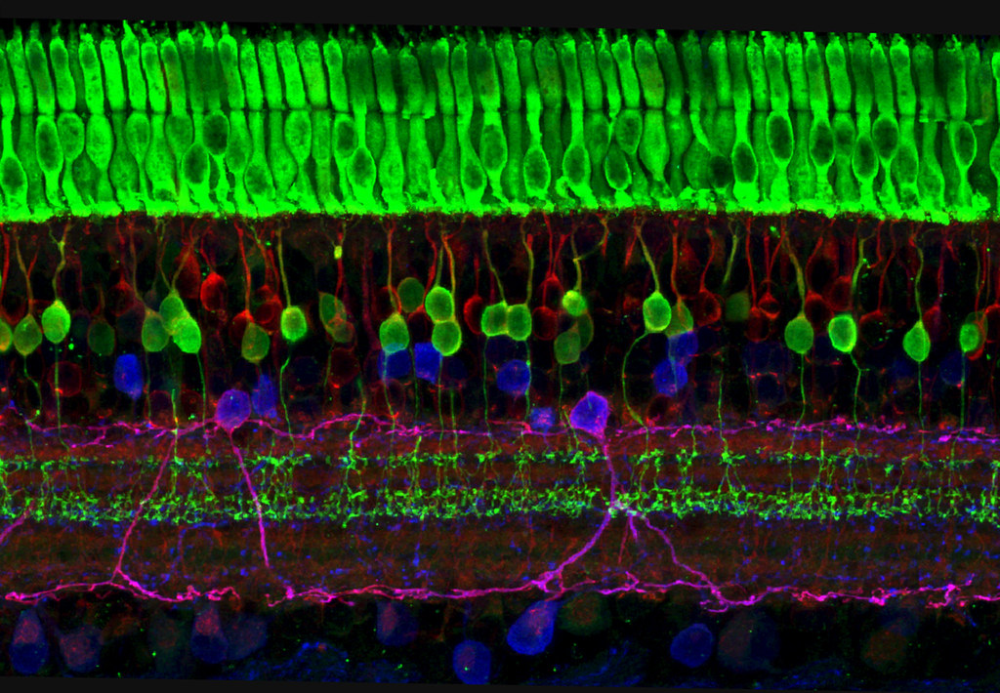
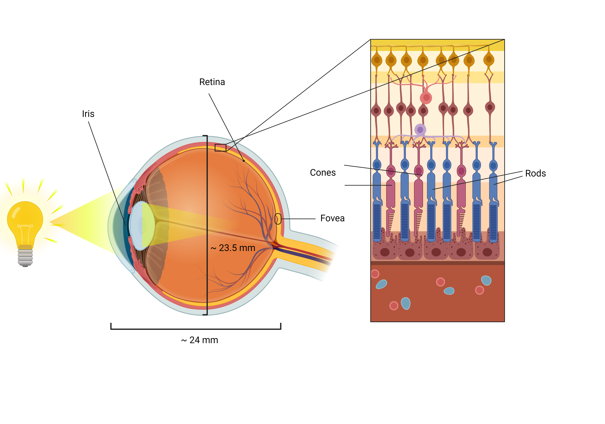
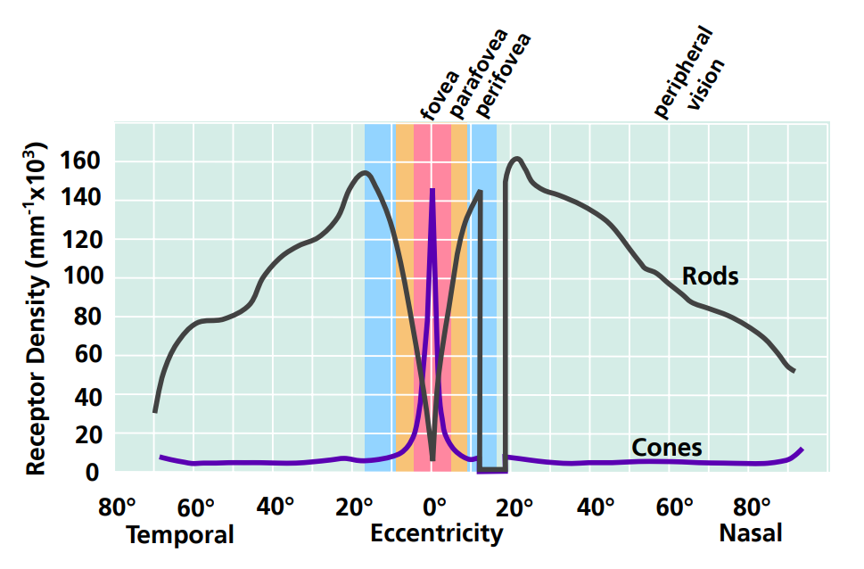
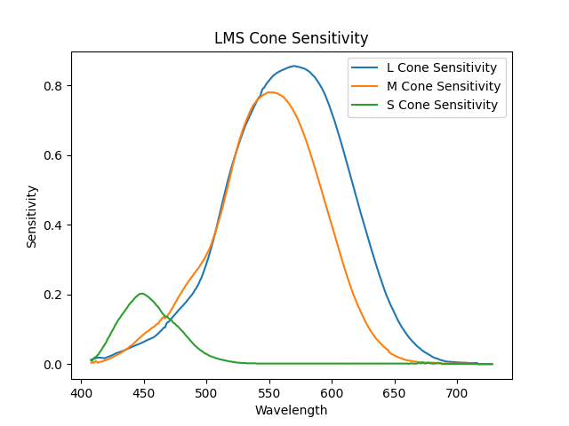

## Color Perception :material-alert-decagram:{ .mdx-pulse title="Too important!" }
:octicons-info-24: Informative ·
:octicons-beaker-24: Practical

We can establish an understanding on color perception through studying its physical and perceptual meaning.
This way, we can gather more information on its relation to technologies and devices including displays, cameras, sensors, communication devices, computers and computer graphics.

Color, a perceptual phenomenon, can be explained in a physical and visual perception capacity.
In the physical sense, color is a quantity representing the response to wavelength of light.
The human visual system can perceive colors within a certain range of the electromagnetic spectrum, from around 400 nanometers to 700 nanometers.
For greater details on the electromagnetic spectrum and concept of wavelength, we recommend revisiting [Light, Computation, and Computational Light](computational_light.md) section of our course.
For the human visual system, color is a perceptual phenomenon created by our brain when specific wavelengths of light are emitted, reflected, or transmitted by objects.
The perception of color originates from the absorption of light by photoreceptors in the eye.
These photoreceptor cells convert the light into electrical signals to be interpreted by the brain[@freeman2011metamers].
Here, you can see a close-up photograph of these photoreceptor cells found in the eye.

<figure markdown>
  { width="600" }
  <figcaption>Micrograph of retinal photoreceptor cells, with rods and cones highlighted in green (top row). Image courtesy of NIH, licensed under CC PDM 1.0. <a href="https://www.nih.gov/" target="_blank">View source</a>.</figcaption>
</figure>

The photoreceptors, where color perception originates, are called [rods and cones](https://www.ncbi.nlm.nih.gov/pmc/articles/PMC4763127/)[@lamb2015why]. 
Here, we provide a sketch showing where these rods and cones are located inside the eye.
By closely observing this sketch, you can also understand the basic average geometry of a human eye and its parts helping to redirect light from an actual scene towards retinal cells.

<figure markdown>
  { width="600" }
  <figcaption>Anatomy of an Eye (Designed with <a href="https://app.biorender.com/citation/6702e9cd8e56383950107e6d" target="_blank">BioRender.com</a>).</figcaption>
</figure>

Rods, which are relatively more common in the periphery, help people see in low-light (scotopic) conditions.
The current understanding is that the roids can only interpret in a greyscale manner.
Cones, which are more dense in the fovea, are pivotal in color perception in brighter (photopic) environments. 
We highlight the distribution of these photoreceptor cells, rods and cones with changing eccentricities in the eye.
Here, the word `eccentricities` refer to angles with respect to our gaze direction.
For instance, if a person is not directly gazing at a location or an object in a given scene, that location or the object would have some angle to the gaze of that person.
Thus, there would be at some angles, some eccentricity between the gaze of that person and that location or object in that scene.

<figure markdown>
  { width="600" }
  <figcaption>Retinal Photoreceptor Distribution, adapted from the work by Goldstein et al [3].</figcaption>
</figure>

In the above sketch, we introduced various parts on the retina, including fovea, parafovea, perifovea and peripheral vision.
Note that these regions are defined by the angles, in other words eccentricities.
Please also note that there is a region on our retina where there are no rods and cones are available.
This region could be found in every human eye and known as the blind spot on the retina.
Visual acuity and contrast sensitivity decreases progressively across these identified regions, with the most detail in the fovea, diminishing toward the periphery.

<figure markdown>
  { width="600" }
  <figcaption>Spectral Sensitivities of LMS cones</figcaption>
</figure>

The cones are categorized into three types based on their sensitivity to specific wavelengths of light, corresponding to long (L), medium (M), and short (S) wavelength cones. These [three types of cones](https://opg.optica.org/josaa/fulltext.cfm?uri=josaa-31-4-A195&id=279354)[@schmidt2014neurobiological] allow us to better understand the [trichromatic theory](https://www.jstor.org/stable/82365)[@rspb1942trichromatic], suggesting that human color perception stems from combining stimulations of the LMS cones. Scientists have tried to graphically represent how sensitive each type of cone is to different wavelengths of light, which is known as the spectral sensitivity function[@stockman2000spectral].
??? question end "Looking for more reading to expand your understanding on human visual system?"
       We recommend these papers, which we find it insightful:
       <br />- [ B. P. Schmidt, M. Neitz, and J. Neitz, "Neurobiological hypothesis of color appearance and hue perception," J. Opt. Soc. Am. A 31(4), A195–207 (2014)](https://doi.org/10.1364/josaa.31.00a195)
       <br />- [Biomimetic Eye Modeling & Deep Neuromuscular Oculomotor Control](https://www.andrew.cmu.edu/user/aslakshm/pdfs/siggraph19_eye.pdf)


The story of color perception only deepens with the concept of [color opponency](http://dx.doi.org/10.1364/JOSAA.34.001099)[@shevell2017color]. This theory reveals that our perception of color is not just a matter of additive combinations of primary colors but also involves a dynamic interplay of opposing colors: red versus green, blue versus yellow. This phenomenon is rooted in the neural pathways of the eye and brain, where certain cells are excited or inhibited by specific wavelengths, enhancing our ability to distinguish between subtle shades and contrasts.

We could exercise on our understanding of trichromat sensation with LMS cones and the concept of color oppenency by vising the functions available in our toolkit, `odak`.
The utility function we will review is [`odak.learn.perception.color_conversion.primaries_to_lms()`](https://github.com/kaanaksit/odak/blob/321760f2f2f3e2639301ecb32535cc801f53dd64/odak/learn/perception/color_conversion.py#L292) from [`odak.learn.perception`](../odak/learn_perception.md).
Let us use this test to demonstrate how we can obtain LMS sensation from the color primaries of an image.

=== ":octicons-file-code-16: `test_learn_perception_display_color_hvs.py`"
  ```python 
  --8<-- "test/test_learn_perception_display_color_hvs.py"
  ```

  1. Adding `odak` to our imports.
  2. Generating arbitrary target primaries (the sample image).
  3. Generate arbitrary primaries spectrum
  4. Select your device where tensors will be allocated
  5. Obtain LMS cone sensation
  <br />
  This a visualization of a randomly generated image and its' LMS cone sensation.

<figure markdown>
  { width="600" }
  <figcaption>Sample Generated Image Primaries</figcaption>
</figure>
<figure markdown>
  { width="600" }
  <figcaption>LMS Sensation of Image Primaries</figcaption>
</figure>


<!--
### Display Realism (What does it mean to be realistic)

When considering the realism of displays, it is important to define what realism entails in the context of color perception. If we were to have a display, disregarding all cost and engineering challenges, just solely built to be "lifelike", what would we need to achieve? 

To answer this question, we would need to be able to apply the complex principles of human color perception and display technologies.

#### Accurate Reproduction of Colors (or at least perceptible): 
The most important characteristic of a realistic display is to accurately reproduce color. Current display technologies combine three color primaries (Red, Green, Blue) in different intensities attempting to recreate large ranges of color called a color space. It is possible to choose different primary colors, or even the number of primaries to represent one's color space, but its efficacy can be expressed by how vast the resulting color space is. The human color gamut is a collection of all visible human lights, and is currently impossible to represent with only three primaries. Because the gamut is continuous and infinite, you would need an infinite amount of primaries to represent all colors.

Fortunately, one promising solution is the use of *metamers*— applying different combinations of wavelengths that produce the same color perception in the human eye. This means two separate colors can elicit the same LMS cone response as each other. This allows displays to recreate a vast range of colors on a limited set of primaries.

[Code](https://gulpinhenry.github.io/PrismaFoveate/optimize_primaries.html) on how to optimize display primaries with a color space


#### Accounting for Photopic vs Scotopic vision
Human perception is extremely context dependent, where we need to adapt to various lighting conditions like low-light (scotopic) and lit (photopic) scenes. Displays must be able to figure out how to preserve the rod and cone functionality under all these different environments.


#### Chromaticity + Brightness
TODO: add some more stuff here


### Conclusion
As we dive deeper into light and color perception, it becomes evident that the task of replicating the natural spectrum of colors in technology is still an evolving journey. This exploration into the nature of color sets the stage for a deeper examination of how our biological systems perceive color and how technology strives to emulate that perception.

-->

??? tip end "Consider revisiting this chapter"
    Remember that you can always revisit this chapter as you progress with the course and as you need it.
    This chapter is vital for establishing a means to complete your assignments and could help formulate a suitable base to collaborate and work with [my research group](https://complightlab.com) in the future or other experts in the field.

!!! warning end "Reminder"
    We host a Slack group with more than 300 members.
    This Slack group focuses on the topics of rendering, perception, displays and cameras.
    The group is open to public and you can become a member by following [this link](https://complightlab.com/outreach/).
    Readers can get in-touch with the wider community using this public group.
