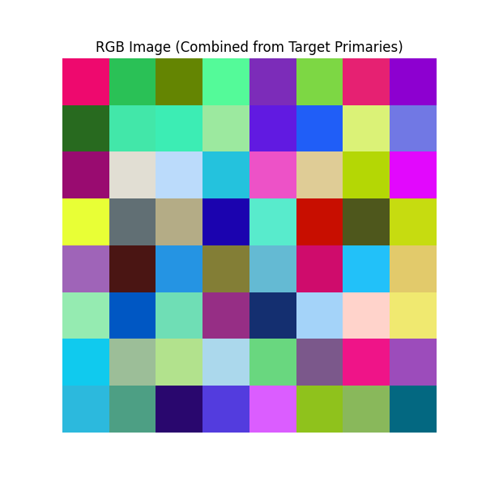

# Color Perception


The utility function we will review is [`odak.learn.perception.color_conversion.primaries_to_lms()`](https://github.com/kaanaksit/odak/blob/321760f2f2f3e2639301ecb32535cc801f53dd64/odak/learn/perception/color_conversion.py#L292):


Let us use this utility function to show how we can obtain LMS sensation from the color primaries of an image:

```python
import odak # (1)
import torch
import sys
from odak.learn.perception.color_conversion import display_color_hvs
from odak.learn.tools import load_image, save_image, resize 

num_primaries = 3
image_primaries = torch.rand(1,
                             num_primaries,
                             8,
                             8
                             ) # (2)

multi_spectrum = torch.rand(num_primaries,
                            301
                           ) # (3)
device_ = torch.device('cpu') # (4)
display_color = display_color_hvs(read_spectrum ='tensor',
                                  primaries_spectrum=multi_spectrum,
                                  device = device_)
lms_color = display_color.primaries_to_lms(image_primaries)  # (5)
```

1. Adding `odak` to our imports.
2. Generating arbitrary target primaries (the sample image).
3. Generate arbitrary primaries spectrum
4. Select your device where tensors will be allocated
5. Obtain LMS cone sensation using  `odak.learn.perception.color_conversion.primaries_to_lms`


<figure markdown>
  { width="600" }
  <figcaption>Sample Generated Image Primaries</figcaption>
</figure>
<figure markdown>
  { width="600" }
  <figcaption>LMS Sensation of Image Primaries</figcaption>
</figure>


