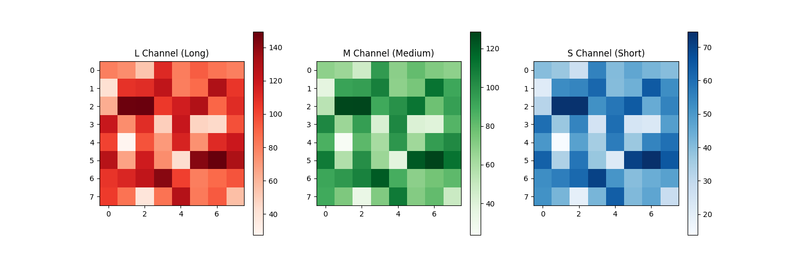

# Color Perception


The utility function we will review is [`odak.learn.perception.color_conversion.primaries_to_lms()`](https://github.com/kaanaksit/odak/blob/321760f2f2f3e2639301ecb32535cc801f53dd64/odak/learn/perception/color_conversion.py#L292):


Let us use this utility function to show how we can obtain LMS sensation from the color primaries of an image:

```python
import odak # (1)
import torch
import sys
from odak.learn.perception.color_conversion import display_color_hvs
from odak.learn.tools import load_image, save_image, resize 

num_primaries = 3
image_primaries = torch.rand(1,
                             num_primaries,
                             8,
                             8
                             ) # (2)

multi_spectrum = torch.rand(num_primaries,
                            301
                           ) # (3)
device_ = torch.device('cpu') # (4)
display_color = display_color_hvs(read_spectrum ='tensor',
                                  primaries_spectrum=multi_spectrum,
                                  device = device_)
lms_color = display_color.primaries_to_lms(image_primaries)  # (5)
```

1. Adding `odak` to our imports.
2. Generating arbitrary target primaries (the sample image).
3. Generate arbitrary primaries spectrum

## Display Realism (What does it mean to be realistic)

When considering the realism of displays, it is important to define what realism entails in the context of color perception. If we were to have a display, disregarding all cost and engineering challenges, just solely built to be "lifelike", what would we need to achieve? To answer this question, we would need to be able to apply the complex principles of human color perception and display technologies. 

1. Accurate Reproduction of Colors (or at least perceptible)
The most important characteristic of a realistic display is to accurately reproduce color. Current display technologies combine three color primaries (Red, Green, Blue) in different intensities attempting to recreate large ranges of color called a color space. It is possible to choose different primary colors, or even the number of primaries to represent one's color space, but its efficacy can be expressed by how vast the resulting color space is. The human color gamut is a collection of all visible human lights, and is currently impossible to represent with only three primaries. Because the gamut is continuous and infinite, you would need an infinite amount of primaries to represent all colors.

Fortunately, one promising solution is the use of **metamers**— applying different combinations of wavelengths that produce the same color perception in the human eye. This means two separate colors can ellicit the same LMS cone response as each other. This allows displays to recreate a vast range of colors on a limited set of primaries. 
!! TODO: talk about generating the color space with primaries 

2. Accounting for Photopic vs Scotopic vision
Human perception is extremely context dependent, where we need to adapt to various lighting conditions like low-light (scotopic) and lit (photopic) scenes. Displays must be able to figure out how to preserve the rod and cone functionality under all these different environments.


### Chromaticity + Brightness
<!-- TODO: add some more stuff here -->


## Conclusion
As we dive deeper into light and color perception, it becomes evident that the task of replicating the natural spectrum of colors in technology is still an evolving journey. This exploration into the nature of color sets the stage for a deeper examination of how our biological systems perceive color and how technology strives to emulate that perception.
4. Select your device where tensors will be allocated
5. Obtain LMS cone sensation using  `odak.learn.perception.color_conversion.primaries_to_lms`


<figure markdown>
  { width="600" }
  <figcaption>Sample Generated Image Primaries</figcaption>
</figure>
<figure markdown>
  { width="600" }
  <figcaption>LMS Sensation of Image Primaries</figcaption>
</figure>


